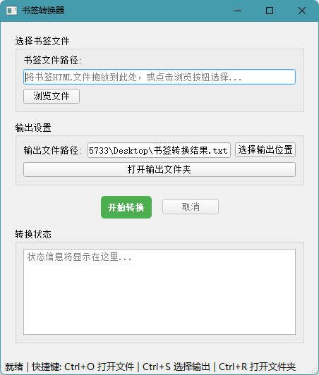

# 书签转换器 (Bookmark Converter)

一个将 Chrome 书签 HTML 文件转换为文本文件的工具，提供图形界面和命令行两种版本。


## 功能特点

- **图形界面 (GUI)**：直观易用的 PyQt5 界面
- **命令行版本**：支持批量处理和脚本集成
- **文件拖放**：可将书签 HTML 文件直接拖放到输入框
- **自定义输出**：默认输出到桌面，支持自定义位置
- **快捷键支持**：
  - `Ctrl+O`：打开文件选择对话框
  - `Ctrl+S`：选择输出文件路径
  - `Ctrl+R`：打开输出文件夹
- **实时状态显示**：转换进度和状态实时显示
- **多线程处理**：转换过程在后台进行，界面不卡顿
- **绿色软件**：提供免安装的可执行文件版本

## 下载与安装

### 方式一：绿色软件（推荐）
直接从 [Releases](https://github.com/CloudPriest/bookmarks2txt/releases) 页面下载最新版本的可执行文件：
- `书签转换器.exe` - Windows 免安装版本
- `书签转换器.zip` - 完整发布包（包含示例和文档）

### 方式二：源码运行
1. 确保安装 Python 3.6+ 和 PyQt5：
   ```bash
   pip install PyQt5
   ```
2. 下载源码：
   ```bash
   git clone https://github.com/CloudPriest/bookmarks2txt.git
   cd bookmarks2txt
   ```
3. 运行程序：
   ```bash
   python src/bookmark_converter_gui.py
   ```

## 使用方法

### 图形界面版本
1. 运行 `书签转换器.exe` 或 `python src/bookmark_converter_gui.py`
2. 选择 Chrome 导出的书签 HTML 文件（可拖放）
3. 确认或修改输出文件路径（默认桌面）
4. 点击"开始转换"按钮
5. 等待转换完成，可点击"打开输出文件夹"查看结果

### 命令行版本
```bash
# 基本用法
python src/chrome_bookmarks_to_txt.py bookmarks.html

# 指定输出文件
python src/chrome_bookmarks_to_txt.py bookmarks.html -o output.txt

# 查看帮助
python src/chrome_bookmarks_to_txt.py -h
```

### 获取 Chrome 书签文件
1. 打开 Chrome 浏览器
2. 按 `Ctrl+Shift+O` 打开书签管理器
3. 点击右上角三个点菜单
4. 选择"导出书签"
5. 保存为 HTML 文件

## 输出格式

转换后的文本文件包含两部分：

### 第一部分：纯链接列表
```
==================================================
第一部分：纯链接列表
==================================================

https://www.google.com/
https://www.github.com/
https://www.python.org/
```

### 第二部分：详细书签列表
```
==================================================
第二部分：详细书签列表
==================================================

1
Google
https://www.google.com/

2
GitHub
https://www.github.com/

3
Python
https://www.python.org/
```

## 项目结构
```
bookmark-converter/
├── src/                    # 源代码
│   ├── bookmark_converter_gui.py    # 图形界面版本
│   └── chrome_bookmarks_to_txt.py   # 命令行版本
├── dist/                   # 打包的可执行文件
├── examples/               # 示例文件
│   └── sample_bookmarks.html
├── docs/                   # 文档
├── tests/                  # 测试文件
├── .gitignore              # Git 忽略文件
├── LICENSE                 # MIT 许可证
├── README.md               # 本文件
├── requirements.txt        # Python 依赖
└── setup.py               # 安装脚本
```

## 开发指南

### 环境设置
```bash
# 克隆仓库
git clone https://github.com/CloudPriest/bookmarks2txt.git
   cd bookmarks2txt

# 创建虚拟环境（可选）
python -m venv venv
source venv/bin/activate  # Linux/Mac
# 或
venv\Scripts\activate     # Windows

# 安装依赖
pip install -r requirements.txt
```

### 依赖项
- Python 3.6+
- PyQt5 >= 5.15

### 运行测试
```bash
python -m pytest tests/
```

### 打包为可执行文件
```bash
# 安装 PyInstaller
pip install pyinstaller

# 打包 GUI 版本
pyinstaller --name="书签转换器" --windowed --icon=assets/icon.ico src/bookmark_converter_gui.py

# 打包命令行版本
pyinstaller --name="书签转换器CLI" --console src/chrome_bookmarks_to_txt.py
```


## 许可证

本项目采用 MIT 许可证 - 查看 [LICENSE](LICENSE) 文件了解详情。

## 支持与反馈

- 问题报告：[GitHub Issues](https://github.com/yourusername/bookmark-converter/issues)
- 功能建议：[GitHub Discussions](https://github.com/yourusername/bookmark-converter/discussions)
- 邮箱：2930406390@qq.com

## 更新日志

### v1.0.0 (2024-03-15)
- 首次发布
- 图形界面版本
- 命令行版本
- 文件拖放支持
- 多线程转换
- 绿色软件打包